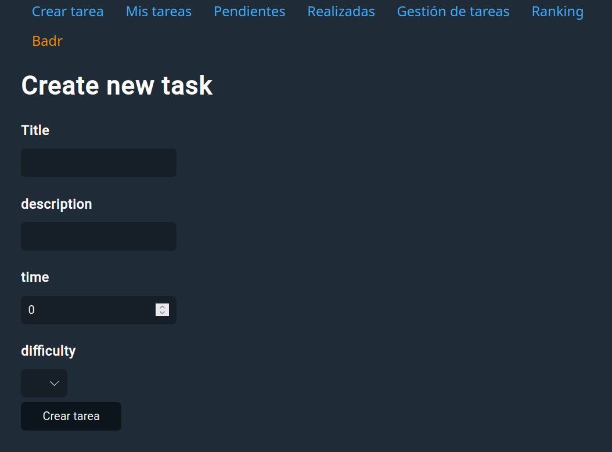
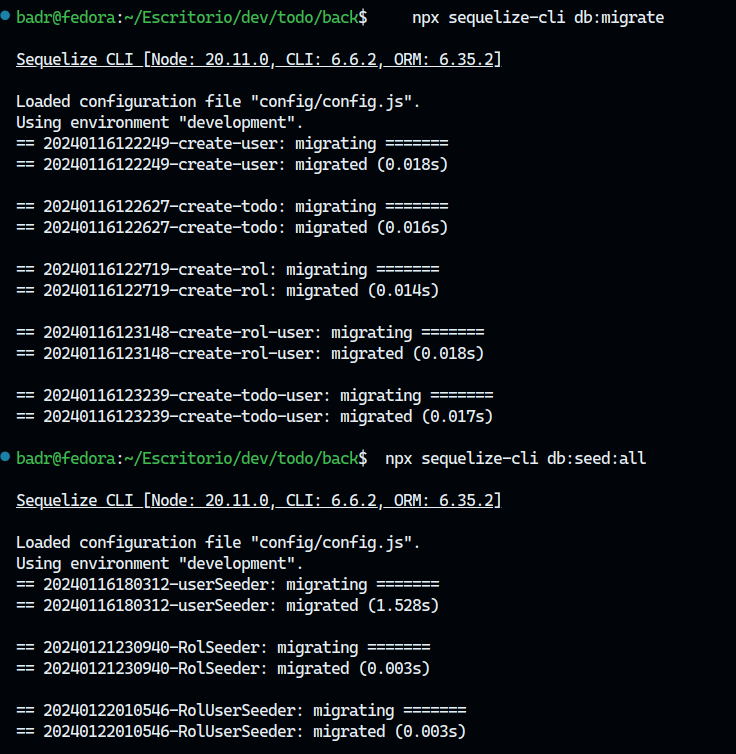

# todo-app

Con express en el back y angular en el front, con este software, podrás organizar tareas.



## Requisitos Previos

Asegúrate de tener instalado lo siguiente:

- Node.js y npm
- Angular CLI
- MySQL Server
- MySQL Client (p. ej. MySQL Workbench)

## Configuración del Backend (Express)

1. Navega al directorio del proyecto y ejecuta:

   ```bash
   cd back
   npm install
   ```

2. Cambiar el nombre de `.env.example` a `.env`, y crear una base de datos y ponerla en DB_*:

    ```.env
        DB_DEV="node_crud_todo"
        DB_PROD="node_crud_todo"
        DB_TEST="node_crud_todo"
    ```

3. Instalar en local sequelize:

    ```sh
        npm install --save-dev sequelize-cli
    ```

4. Realizar migraciones y lanzar seeders:

migración:
```sh
    npx sequelize-cli db:migrate
```

Seeders:

```sh
    npx sequelize-cli db:seed:all
```



5. Ejecutar el servidor:

   ```bash
   npm start
   ```

## Configuración del Frontend (Angular 17)

1. Navega al directorio del proyecto y ejecuta:

   ```bash
   cd front
   npm install
   ```

2. Actualiza en `src\envirnments` la url del backend, en caso de que montes el backend en otro puerto.

4. Inicia la aplicación Angular:

   ```bash
   ng serve
   ```

## Error base de datos

En caso de que la migración y seeders den problemas, importar el fichero dump.sql en phpMyAdmin.
